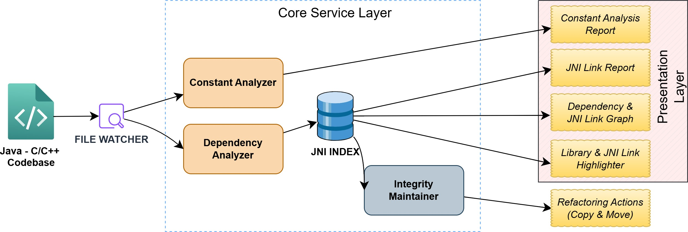

# Crosslink

CrossLink is an Static analysis tool designed to bridge the gap between Java and C/C++ codebases. It monitors
 file changes, analyzes JNI (Java Native Interface) dependencies, and maintains the integrity of cross-language 
 links, ensuring that refactoring in one language doesn't break the connection to the other.

### Overview
Maintaining large codebases that utilize JNI is challenging because standard IDEs often fail to track 
dependencies across the language barrier. CrossLink solves this by providing real-time analysis, 
dependency graphing, and automated refactoring support.

## Architecture



The system is composed of three primary layers:

- **Input Layer**: Monitors the Java - C/C++ Codebase using a File Watcher to detect real-time changes.
- **Core Service Layer**:
  -**Constant Analyzer**: Tracks shared constants between Java and Native code.
  -**Dependency Analyzer**: Maps the relationships between Java classes and C++ headers/implementations.
  -**JNI Index**: A central database storing the mapping of all links.
  -**Integrity Maintainer**: Ensures that moves or renames do not result in broken links.

-**Presentation Layer**: Provides actionable insights including:
  -**Constant Analysis & JNI Link Reports**.
  -**Visual Dependency Graphs**.
  -**Syntax Highlighting for JNI links**.
  -**Automated Refactoring Actions (Copy & Move)**.


## Features


### Dependency Visualization and Verification.
  - **Dependency and JNI Link Graph**: The tool creates a visual graph of file-level dependencies. 
  It clearly marks nodes where JNI implementations are missing. This gives developers a high-level 
  view of the project’s binding status.
  - **JNI Link Report**: While the graph shows file dependencies,the Link Report panel provides 
  detailed, method-level dependencies in a table format. It lists every specific Java-to-C++
  method link.


### Interactive Navigation.
  - **Live Link Highlighting**: As developers type, the tool highlights native method declarations 
  in real-time (green for linked, red for broken). This prevents waiting for runtime 
  UnsatisfiedLinkError exceptions. As explaied in below code snippet.
  - **Cross-Language Navigation**: Developers can click on a successfully linked Java native method 
  to quickly jump to its corresponding C++ implementation definition. This simplifies code 
  exploration. In figure 2 we can see Goto implementation option above the highlighted link.

### Link Integrity and Constant Naming.
 - **JNI Link Integrity Maintainer**: Developers can move or copy native methods between Java 
 classes, CrossLink automatically updates the corresponding C++ function signatures to match 
 the new package and class path, preventing broken links.
 - **Constant Naming Assistance**: The tool identifies numeric values passed across the JNI 
 boundary and suggests meaningful constant names in a centralized “Constant Analysis” panel.

During copy operations, CrossLink checks for an existing C/C++ implementation file for the target 
java file and generates the correct JNI function name & signature. If no file exists, it 
initializes one,though developers must manually transfer the function body. Move operations 
automatically update the JNI function name in the source C/C++ file.

The constant naming assistance uses a rule-based engine that analyzes each value’s context against 
predefined patterns to suggest descriptive identifiers. For example, the system applies a TimeDomain 
rule to suggest TIMEOUT_DURATION for values like 3000 in time-sensitive code, an Infrastructure rule 
to propose SERVER_PORT for 8080 in networking contexts, and recognizes mathematical operations like 
price * 1.15 to suggest TAX_RATE_MULTIPLIER.


### 🎨 Cross-Language Code Highlighting
- **Library Loading**: Highlights `System.loadLibrary()` calls with different colors based on OS compatibility and file presence
- **Native Method Linking**: Highlights native method declarations and checks for corresponding C++ implementations
- **Color-coded status**:
  - 🔴 **Red**: Library file is missing or native method implementation is missing
  - 🔵 **Blue**: Library exists but has wrong extension for current platform
  - 🟢 **Green**: Library exists with correct extension or native method has C++ implementation
- **Platform detection**: Automatically detects OS and expects appropriate library extensions:
  - Windows: `.dll`
  - Linux: `.so`
  - macOS: `.dylib`

- **Hover information**: Detailed information about library status and native method implementation when hovering over highlighted code


### 📊 Constants Management
- **Constants analyzer**: Scans for constants across Java and C++ files
- **Naming suggestions**: Provides constant naming based on context and usage
- **Magic number identification**: Detects numbers that should be extracted as constants
- **Context-aware categorization**: Groups constants by type, file, or usage context


### 🎛️ Interactive Dashboard
- **Webview-based control panel**: UI for managing all features
- **Real-time statistics**: Shows dependency counts, connection metrics, and constants analysis
- **Search and filtering**: Advanced filtering capabilities for all data (or in simple terms a search button)
- **Quick actions**: Context menus for common refactoring operations (Copy or Move)

## Requirements

- Visual Studio Code
- Java projects with native dependencies (JNI)
- C++ projects that interface with Java


#### Example:
```java
public class HelloJNI {
    static {
        System.loadLibrary("hello");  // Highlighted based on file presence
    }

    // Native method declarations - highlighted based on C++ implementation
    private native void sayHello();           // Green if implemented in C++
    public native int add(int a, int b);      // Green if implemented in C++
    public native String getMessage(String name); // Red if not implemented in C++
}
```


# Running the Cross-Language Dependency Visualizer Extension

# Clone the repository
```terminal
git clone https://github.com/yourusername/crosslink.git
```
# Navigate to the directory
cd crosslink


Launch Extension Host

1. Open the project folder in VS Code
2. Press **F5** (or go to **Run → Start Debugging**) click on "Debug Anyway" if popup comes.
3. A new VS Code window will open with the extension loaded
4. Open any java file from a JNI project.

For testing you can use this JNI repo https://community.opengroup.org/osdu/platform/domain-data-mgmt-services/seismic/open-vds


## Release Notes

### 1.1.0

- **NEW**: Added library loading code highlighting feature
  - Color-coded highlighting for `System.loadLibrary()` calls
  - Platform-aware library file detection
  - Hover information and code lens support
  - Automatic OS detection and extension validation
- Enhanced dependency analysis for cross-language projects
- Improved constants management with better naming suggestions
- Added comprehensive dashboard with real-time statistics

### 1.0.0

Initial release with basic dependency visualization and refactoring tools.

---

## Following extension guidelines

Ensure that you've read through the extensions guidelines and follow the best practices for creating your extension.

* [Extension Guidelines](https://code.visualstudio.com/api/references/extension-guidelines)

## Working with Markdown

You can author your README using Visual Studio Code. Here are some useful editor keyboard shortcuts:

* Split the editor (`Cmd+\` on macOS or `Ctrl+\` on Windows and Linux).
* Toggle preview (`Shift+Cmd+V` on macOS or `Shift+Ctrl+V` on Windows and Linux).
* Press `Ctrl+Space` (Windows, Linux, macOS) to see a list of Markdown snippets.

## For more information

* [Visual Studio Code's Markdown Support](http://code.visualstudio.com/docs/languages/markdown)
* [Markdown Syntax Reference](https://help.github.com/articles/markdown-basics/)

